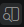
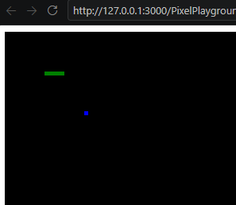
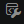
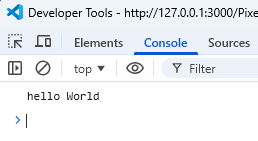

# PixelPlayground
A small playground to play with functions drawing pixels.

- Open the folder in VSCode
- Open the file exercise1.html
- Open the preview by clicking on the preview icon on the top right corner of the file . __Note__ This is only visible if you have installed the live preview extension.

You should see something like this:
v

- Open the file playground.js

You see the functions you can call.

```javascript
clearScreen("black");
drawPixel(20, 20, "blue");
drawHorizontalLine(10, 10, "green");
console.log("hello World");
```

The result of `clearScreen()`, `drawPixel()` and `drawHorizontalLine()` is visible.

In order to see the effect of `console.log()` you have to press `F12` or click on this icon: 

This opens the developer console, where you see something like this :
.

## Get playing

- change the text in `console.log()` to something more personal, like `"hello Peter"`.
- draw more Pixels in more colors by calling `drawPixel()`
- draw more lines by calling `drawHorizontalLine()`
- try to draw a house
